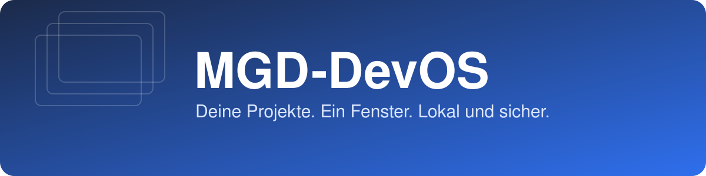

<p align="center"></p>

<p align="center">
  <a href="https://github.com/MichaelGahnDESIGN/MGD-DevOS/actions/workflows/ci.yml"></a>
  
  
  
</p>

**MGD-DevOS** ist die Desktop-Zentrale für deine Projekte: ein Fenster mit Tabs, in dem du
zwischen den Dashboards aller Projekte wechselst. Die Daten liegen in deinen lokalen
Projektordnern, die Claude, Codex & Co. anlegen und pflegen. Die App zeigt sie an, sie
braucht deshalb keinen eigenen Server und keinen Updater für Inhalte.

> **Ehrlicher Stand (v0.1):** Die App ist gebaut und getestet (`flutter analyze`, 15 Tests),
> aber noch **auf keinem Betriebssystem als fertiger Installer geprüft**. Es gibt noch kein
> Installationspaket. Details unter [Status](#status).

## Einrichten und Starten

Gib deinem Assistenten (Claude Code, ChatGPT Codex, ...) den Link zum Projektmanager und
diesen Text:

```text
Einrichten und Starten: Installiere den Skill aus
https://github.com/MichaelGahnDESIGN/MGD_AI-Projektmanager,
starte /projektstart und richte gemeinsam mit mir Projektordner, Todo und
Living Documentation ein. Öffne am Ende das Dashboard, lege nach meiner
Bestätigung eine Verknüpfung auf den Desktop und erkläre mir, wie ich damit arbeite.
```

Danach öffnest du MGD-DevOS. Aus dem Quellcode:

```bash
git clone https://github.com/MichaelGahnDESIGN/MGD-DevOS.git
cd MGD-DevOS
flutter pub get
flutter run -d macos     # oder: -d windows / -d linux
```

Fertige Installer (DMG, ZIP, TAR.GZ) entstehen über die Release-Pipeline, siehe [Release](wiki/Release-Prozess.md).

## Was die App kann

| | |
|---|---|
| **Tab-Browser** | Tab „Übersicht" plus je ein Tab pro geöffnetem Projekt-Dashboard (`index.html`). Tabs wechseln und schließen. |
| **Projektregister** | Scannt deinen Projektordner nach echten Projekten (Git, README, AGENTS.md, ...) und öffnet Dokumente. |
| **Agentic Control Panel** | Zeigt Agenten, Skills und Integrationen aus `AGENTS.md` und `catalog/*.json`, mit Quelle und Zeitstempel. Nie ein erfundener „aktiv"-Status. |
| **Darstellung** | Hell, Dunkel oder System, eigene Akzentfarbe. |
| **Sicher by Design** | Alles lokal, keine Telemetrie, keine Zugangsdaten, Webview nur für Dateien im Projektordner. |

## So funktioniert es

```
Assistent (Claude/Codex)  ──pflegt──▶  Projektordner  ◀──liest──  MGD-DevOS
   /projektstart, /todo …              index.html, docs/, catalog/      Tabs · Scanner · Panel
```

## Status

| Bereich | Stand |
|---|---|
| Code, Analyse, Tests | ✅ grün (15 Tests) |
| macOS/Windows/Linux-Build | ⏳ nicht verifiziert: CI-Läufe sind durch ein GitHub-Abrechnungsproblem blockiert, lokal fehlt Xcode |
| Dashboard im Webview (`file://`) | ⏳ nur Logik getestet, nicht real auf macOS/Windows |
| Linux | eingebettetes WebView nicht verfügbar, Dashboard öffnet im Browser |
| Signierung/Notarisierung | ❌ nicht vorhanden (Apple Developer Program nötig) |
| App-Sperre, Schlüsselbund, Live-Agenten-Adapter | ❌ geplant |
| Spenden (Stripe) | ❌ nicht eingerichtet, siehe [Stripe-Spenden](wiki/Stripe-Spenden.md) |

## Dokumentation

Das ausführliche Wiki liegt im Ordner [`wiki/`](wiki/Home.md): Installation, Erste Schritte,
Tabs, Scanner, Agentic Panel, Sicherheit, Architektur, Entwicklung und CI, Release, Roadmap, FAQ.

## Sicherheit und Datenschutz

Keine Telemetrie, keine Zugangsdaten, keine Netzwerkzugriffe im Normalbetrieb. Gespeichert
werden nur Theme, Akzentfarbe und der Projekt-Root-Pfad. Mehr: [Sicherheit](wiki/Sicherheit-und-Datenschutz.md).

## Mitwirken

Regeln für Beiträge, Tests und CI stehen in [Entwicklung und CI](wiki/Entwicklung-und-CI.md).
