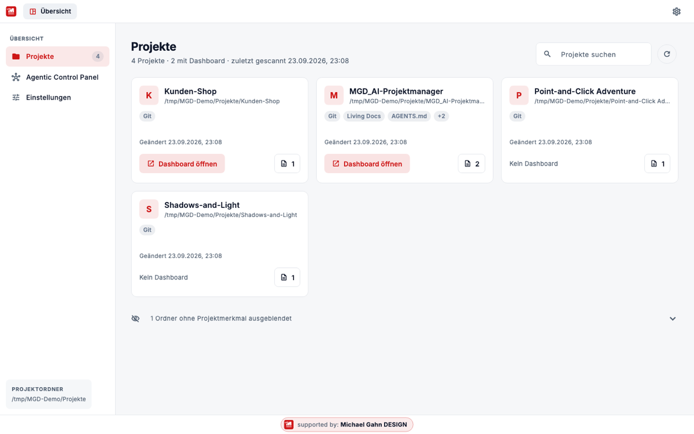
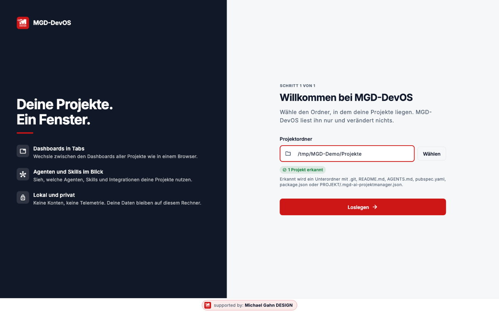
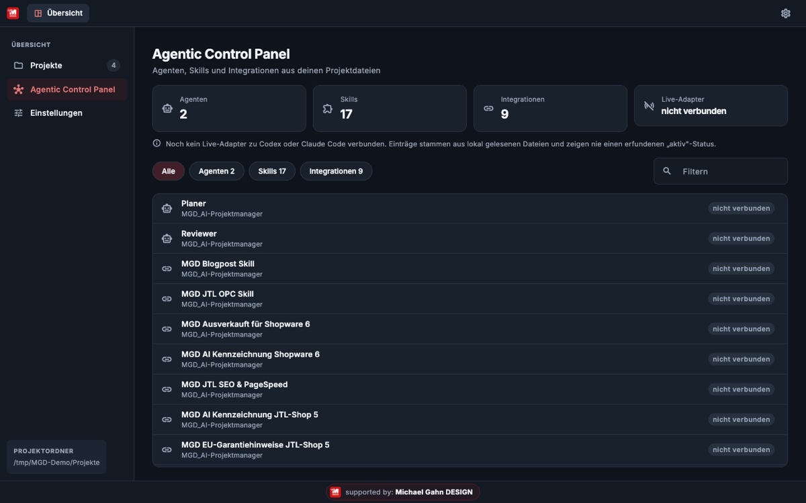
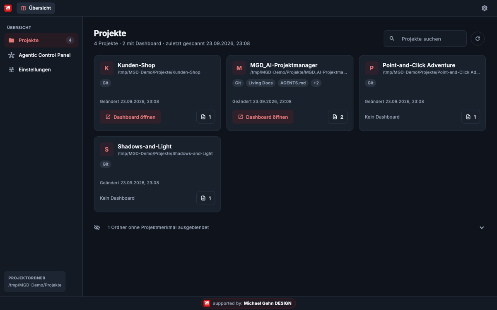
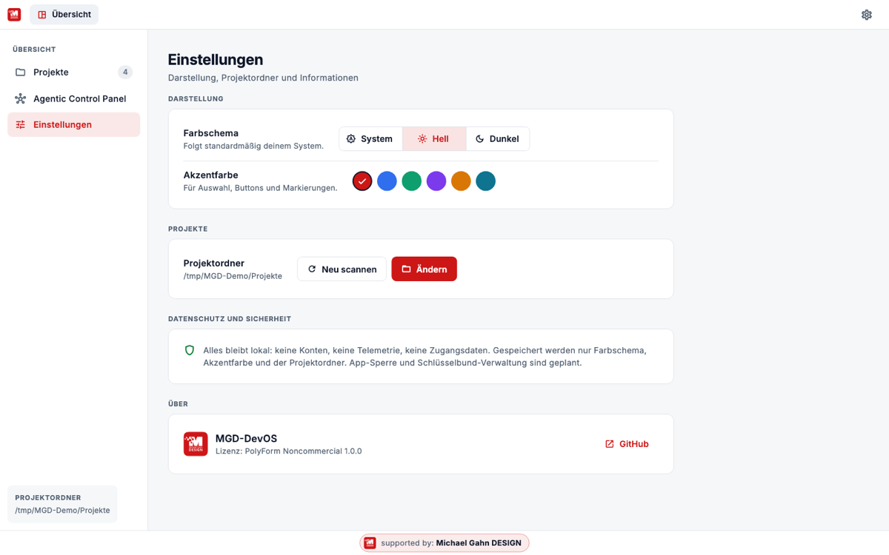

<p align="center"><a href="https://Michael-Gahn.de"></a></p>

<p align="center"></p>

<p align="center">
  <a href="https://github.com/MichaelGahnDESIGN/MGD-DevOS/actions/workflows/ci.yml"></a>
  
  <a href="https://github.com/MichaelGahnDESIGN/MGD-DevOS/releases/latest"></a>
  <a href="LICENSE"></a>
  
</p>

**MGD-DevOS** ist die Desktop-Zentrale für deine Projekte: ein Fenster mit Tabs, in dem du
zwischen den Dashboards aller Projekte wechselst. Die Daten liegen in deinen lokalen
Projektordnern, die Claude, Codex & Co. anlegen und pflegen. Die App zeigt sie an, sie
braucht deshalb keinen eigenen Server und keinen Updater für Inhalte.

> **Stand v0.2.0:** Installer für macOS, Windows und Linux werden über GitHub Actions gebaut
> (alle Builds grün). Sie sind **unsigniert**, siehe [Download](#download). Details unter [Status](#status).

## Download

Aktuelle Version: **[Releases](https://github.com/MichaelGahnDESIGN/MGD-DevOS/releases/latest)**

| System | Datei | Start |
|---|---|---|
| macOS | `MGD-DevOS.dmg` | DMG öffnen, App nach „Programme" ziehen. Beim ersten Start: Rechtsklick → „Öffnen" (unsigniert). |
| Windows | `MGD-DevOS-windows.zip` | Entpacken, `mgd_devos.exe` starten. SmartScreen: „Weitere Informationen" → „Trotzdem ausführen". |
| Linux (x64) | `MGD-DevOS-linux.tar.gz` | `tar -xzf MGD-DevOS-linux.tar.gz && ./bundle/mgd_devos` (benötigt GTK 3). |

Prüfsummen: `SHA256SUMS.txt` im Release, prüfen mit `shasum -a 256 -c SHA256SUMS.txt`.

## Einrichten und Starten

Gib deinem Assistenten (Claude Code, ChatGPT Codex, ...) den Link zum Projektmanager und
diesen Text:

```text
Einrichten und Starten: Installiere den Skill aus
https://github.com/MichaelGahnDESIGN/MGD_AI-Projektmanager,
starte /projektstart und richte gemeinsam mit mir Projektordner, Todo und
Living Documentation ein. Öffne am Ende das Dashboard, lege nach meiner
Bestätigung eine Verknüpfung auf den Desktop und erkläre mir, wie ich damit arbeite.
```

Danach öffnest du MGD-DevOS. Aus dem Quellcode:

```bash
git clone https://github.com/MichaelGahnDESIGN/MGD-DevOS.git
cd MGD-DevOS
flutter pub get
flutter run -d macos     # oder: -d windows / -d linux
```

Fertige Installer: siehe [Download](#download).

## So sieht es aus

<p align="center"></p>

| | |
|---|---|
|  |  |
|  |  |

## Was die App kann

| | |
|---|---|
| **Tab-Browser** | Tab „Übersicht" plus je ein Tab pro geöffnetem Projekt-Dashboard (`index.html`). Tabs wechseln und schließen. |
| **Projektregister** | Scannt deinen Projektordner nach echten Projekten (Git, README, AGENTS.md, ...) und öffnet Dokumente. |
| **Agentic Control Panel** | Zeigt Agenten, Skills und Integrationen aus `AGENTS.md` und `catalog/*.json`, mit Quelle und Zeitstempel. Nie ein erfundener „aktiv"-Status. |
| **Darstellung** | Hell, Dunkel oder System, eigene Akzentfarbe. |
| **Sicher by Design** | Alles lokal, keine Telemetrie, keine Zugangsdaten, Webview nur für Dateien im Projektordner. |

## So funktioniert es

```
Assistent (Claude/Codex)  ──pflegt──▶  Projektordner  ◀──liest──  MGD-DevOS
   /projektstart, /todo …              index.html, docs/, catalog/      Tabs · Scanner · Panel
```

## Status

| Bereich | Stand |
|---|---|
| Code, Analyse, Tests | ✅ grün (15 Tests) |
| macOS/Windows/Linux-Build | ✅ grün auf GitHub Actions, Installer im Release |
| Start auf echten Geräten | ⏳ noch nicht manuell geprüft |
| Dashboard im Webview (`file://`) | ⏳ nur Logik getestet, nicht real auf macOS/Windows |
| Linux | eingebettetes WebView nicht verfügbar, Dashboard öffnet im Browser |
| Signierung/Notarisierung | ❌ nicht vorhanden (Apple Developer Program nötig) |
| App-Sperre, Schlüsselbund, Live-Agenten-Adapter | ❌ geplant |
| Spenden (Stripe) | ❌ nicht eingerichtet, siehe [Stripe-Spenden](wiki/Stripe-Spenden.md) |

## Dokumentation

Das ausführliche Wiki liegt im Ordner [`wiki/`](wiki/Home.md): Installation, Erste Schritte,
Tabs, Scanner, Agentic Panel, Sicherheit, Architektur, Entwicklung und CI, Release, Roadmap, FAQ.

## Sicherheit und Datenschutz

Keine Telemetrie, keine Zugangsdaten, keine Netzwerkzugriffe im Normalbetrieb. Gespeichert
werden nur Theme, Akzentfarbe und der Projekt-Root-Pfad. Mehr: [Sicherheit](wiki/Sicherheit-und-Datenschutz.md).

## Lizenz und Mitwirken

Nutzen, ändern und Änderungen vorschlagen ist erlaubt, **verkaufen oder kommerziell nutzen nicht**
([PolyForm Noncommercial 1.0.0](LICENSE)). Das ist keine Open-Source-Lizenz im Sinne der OSI.
Beiträge willkommen, siehe [CONTRIBUTING.md](CONTRIBUTING.md).


Regeln für Beiträge, Tests und CI stehen in [Entwicklung und CI](wiki/Entwicklung-und-CI.md).

---

<p align="center"><a href="https://Michael-Gahn.de"> <b>supported by: Michael Gahn DESIGN</b></a></p>
