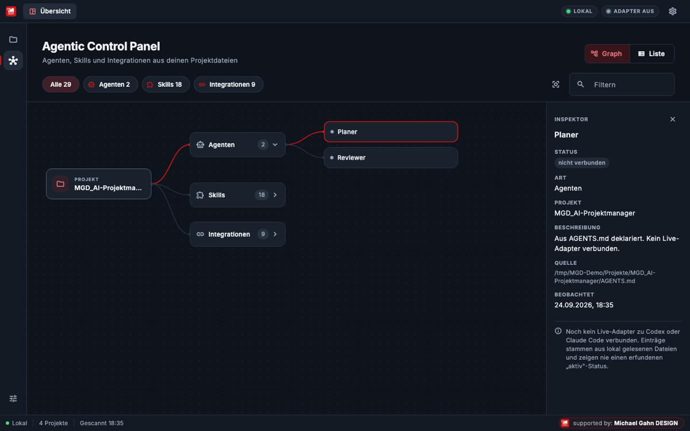

<p align="center"><a href="https://michael-gahn.de" target="_blank" rel="noopener"></a></p>

<p align="center"></p>

<p align="center">
  <a href="https://github.com/MichaelGahnDESIGN/MGD-DevOS/actions/workflows/ci.yml"></a>
  
  <a href="https://github.com/MichaelGahnDESIGN/MGD-DevOS/releases/latest"></a>
  <a href="LICENSE"></a>
  
</p>

**MGD-DevOS** ist deine Projektzentrale aus zwei Teilen in einem Repository:

- **Desktop-App** (Flutter, macOS/Windows/Linux): Tabs für die Dashboards aller Projekte, Agentic Control Panel, PIN-Sichtschutz.
- **Projektmanager-Skill** (`skill/`) für Claude Code, Codex & Co.: Projektstart, Skill-Auswahl, `/dashboard` mit einem
  Dashboard im Stil eines Programms (Menüleiste, verschiebbare Fenster, Einstellungen, Versionen, Credits).

Mit der App wechselst du zwischen den Dashboards aller Projekte. Die Daten liegen in deinen lokalen
Projektordnern, die Claude, Codex & Co. anlegen und pflegen. Die App zeigt sie an, sie
braucht deshalb keinen eigenen Server und keinen Updater für Inhalte.

> **Version <!-- mgd:version -->0.6.0 Pre-Alpha<!-- /mgd:version -->** (App und Skill tragen dieselbe Version). Installer für macOS, Windows und Linux entstehen über GitHub Actions, sie sind
> **unsigniert**, siehe [Download](#download). Versionsschema 1.2.3: 1 = Hauptversion ab Release, 2 = neue Funktionen,
> 3 = Patches. Die Nummer steht zentral in [`assets/meta/version.json`](assets/meta/version.json).

## Download

Aktuelle Version: **[Releases](https://github.com/MichaelGahnDESIGN/MGD-DevOS/releases/latest)**

| System | Datei | Start |
|---|---|---|
| macOS | `MGD-DevOS.dmg` | DMG öffnen, App nach „Programme" ziehen. Beim ersten Start: Rechtsklick → „Öffnen" (unsigniert). |
| Windows | `MGD-DevOS-windows.zip` | Entpacken, `mgd_devos.exe` starten. SmartScreen: „Weitere Informationen" → „Trotzdem ausführen". |
| Linux (x64) | `MGD-DevOS-linux.tar.gz` | `tar -xzf MGD-DevOS-linux.tar.gz && ./bundle/mgd_devos` (benötigt GTK 3). |

Prüfsummen: `SHA256SUMS.txt` im Release, prüfen mit `shasum -a 256 -c SHA256SUMS.txt`.

## Einrichten und Starten

Gib deinem Assistenten (Claude Code, ChatGPT Codex, ...) diesen Text:

```text
Einrichten und Starten: Installiere den Skill aus dem Ordner skill/ von
https://github.com/MichaelGahnDESIGN/MGD-DevOS,
starte /projektstart und richte gemeinsam mit mir Projektordner, Todo und
Living Documentation ein. Öffne am Ende das Dashboard, lege nach meiner
Bestätigung eine Verknüpfung auf den Desktop und erkläre mir, wie ich damit arbeite.
```

Skill von Hand installieren (Claude Code, global):

```bash
git clone --depth 1 https://github.com/MichaelGahnDESIGN/MGD-DevOS.git /tmp/mgd-devos
mkdir -p ~/.claude/skills ~/.claude/commands
mkdir -p ~/.claude/skills/mgd-devos
cp -R /tmp/mgd-devos/skill/. ~/.claude/skills/mgd-devos/
cp ~/.claude/skills/mgd-devos/.claude/commands/*.md ~/.claude/commands/
```

Das kopiert den Skill nach `~/.claude/skills/mgd-devos` und alle Befehle: `/projektstart`, `/projektstart-update`,
`/projektstart-katalog`, `/projektstart-katalog-add` und `/dashboard`. Derselbe Befehl aktualisiert eine bestehende
Installation. Start im Assistenten: `/projektstart`, danach `/dashboard`. Codex und projekt-lokal:
[skill/wiki/Setup.md](skill/wiki/Setup.md).

App aus dem Quellcode:

```bash
git clone https://github.com/MichaelGahnDESIGN/MGD-DevOS.git
cd MGD-DevOS
flutter pub get
flutter run -d macos     # oder: -d windows / -d linux
```

Fertige Installer: siehe [Download](#download).

## So sieht es aus

<p align="center"></p>

| | |
|---|---|
|  |  |
|  |  |

## Was die App kann

| | |
|---|---|
| **Tab-Browser** | Tab „Übersicht" plus je ein Tab pro geöffnetem Projekt-Dashboard (`index.html`). Tabs wechseln und schließen. |
| **Projektregister** | Scannt deinen Projektordner nach echten Projekten (Git, README, AGENTS.md, ...) und öffnet Dokumente. Projekte des [MGD-Plattform-Builders](#zusammenspiel-mit-dem-mgd-plattform-builder) zeigen ihre Version, z. B. „Plattform 0.0.1 Pre-Alpha". |
| **Agentic Control Panel** | Graph aus Projekten, Agenten, Skills und Integrationen (aus `AGENTS.md` und `catalog/*.json`) mit Inspektor, Quelle und Zeitstempel. Nie ein erfundener „aktiv"-Status. |
| **Darstellung** | Hell, Dunkel oder System, eigene Akzentfarbe. |
| **PIN-Sichtschutz** | Optionale PIN beim Start gegen neugierige Blicke. Kein Zugriffsschutz, siehe [Sicherheit und Datenschutz](#sicherheit-und-datenschutz). |
| **Lokal** | Keine Telemetrie, keine Zugangsdaten, Webview nur für Dateien im Projektordner. |

## So funktioniert es

```
Assistent (Claude/Codex)  ──pflegt──▶  Projektordner  ◀──liest──  MGD-DevOS
   /projektstart, /todo …              index.html, docs/, catalog/      Tabs · Scanner · Panel
```

## Status

| Bereich | Stand |
|---|---|
| Code, Analyse, Tests | ✅ grün (<!-- mgd:tests -->29 Tests<!-- /mgd:tests -->) |
| macOS/Windows/Linux-Build | ✅ grün auf GitHub Actions, Installer im Release |
| Start auf echten Geräten | ⏳ noch nicht manuell geprüft |
| Dashboard im Webview (`file://`) | ✅ Integrationstest mit echter App auf macOS und Windows, Linux-Ausweichweg geprüft |
| Linux | eingebettetes WebView nicht verfügbar, Dashboard öffnet im Browser |
| Signierung/Notarisierung | ❌ nicht vorhanden (Apple Developer Program nötig) |
| PIN-Sichtschutz (App und Dashboard) | ✅ vorhanden, nur Sichtschutz, keine Zugriffssicherung |
| Schlüsselbund, Live-Agenten-Adapter | ❌ geplant |
| Spenden (Stripe) | ❌ nicht eingerichtet, siehe [Stripe-Spenden](wiki/Stripe-Spenden.md) |

## Dokumentation

Das ausführliche Wiki liegt im Ordner [`wiki/`](wiki/Home.md): Installation, Erste Schritte,
Tabs, Scanner, Agentic Panel, Sicherheit, Architektur, Entwicklung und CI, Release, Roadmap, FAQ.

## Sicherheit und Datenschutz

Keine Telemetrie, keine Zugangsdaten, keine Netzwerkzugriffe im Normalbetrieb.

- **Gespeichert** (lokale App-Einstellungen des Betriebssystems): Farbschema, Akzentfarbe, Projektordner,
  Onboarding-Status und, falls eine PIN gesetzt ist, deren Länge, Salz und PBKDF2-Hash sowie der Zähler für Fehlversuche.
- **Geschrieben** wird in Projektordner nur, wenn du im Grundregeln-Editor speicherst (`GRUNDREGELN.md`, nach Rückfrage).
  Dashboards im eingebetteten Webview speichern ihre eigenen Einstellungen im Browser-Speicher des Webviews.
- **PIN = Sichtschutz.** Die PIN verdeckt App und Dashboard beim Start vor neugierigen Blicken. Sie schützt nicht vor
  jemandem mit Zugriff auf dein Benutzerkonto oder deine Dateien (Einstellungen löschen genügt, Projektdateien sind
  unverschlüsselt), und es gibt keine automatische Sperre bei Inaktivität.

Mehr: [Sicherheit und Datenschutz](wiki/Sicherheit-und-Datenschutz.md).

## Zusammenspiel mit dem MGD-Plattform-Builder

Der [MGD-Plattform-Builder](https://github.com/MichaelGahnDESIGN/MGD-Plattform-Builder) erzeugt Websites und
Plattformen (Backoffice, Rechte, Rechtstexte, Versionierung) mit der CLI `mgd-platform`. MGD-DevOS ergänzt ihn:

- **Skill:** `/projektstart` empfiehlt den Plattform-Builder bei Web- und Plattform-Projekten und richtet ihn nach
  Zustimmung per `mgd-platform init` ein (siehe [skill/SKILL.md](skill/SKILL.md)).
- **App:** Der Projekt-Scanner erkennt Plattform-Projekte an `MGD_PLATFORM.yml` und zeigt Version und Status aus
  deren `version.json` in der Projektkarte an, z. B. „Plattform 0.0.1 Pre-Alpha".

## Lizenz und Mitwirken

MGD-DevOS (App und Skill) steht unter der **MGD-Lizenz 1.0** ([LICENSE](LICENSE)): Nutzen, auch gewerblich, ändern und
weitergeben ist erlaubt, solange das Label „powered by: Michael Gahn DESIGN" mit Logo und Link sichtbar bleibt und die
Lizenz beiliegt. Entfernen des Labels nur mit Whitelabel-Lizenz. Das ist keine Open-Source-Lizenz im Sinne der OSI.

Frühere Versionen bis einschließlich 0.5.2 wurden unter der PolyForm Noncommercial License 1.0.0 veröffentlicht und
bleiben für diese Versionen unter jener Lizenz.

Beiträge willkommen, siehe [CONTRIBUTING.md](CONTRIBUTING.md). Regeln für Tests und CI stehen in
[Entwicklung und CI](wiki/Entwicklung-und-CI.md).

---

<p align="center"><a href="https://michael-gahn.de" target="_blank" rel="noopener"> <b>powered by: Michael Gahn DESIGN</b></a></p>

<!-- MGD-LEGAL -->
---

## Lizenz

Dieses Projekt steht unter der [MGD-Lizenz 1.0](LICENSE). Den vollständigen Text enthält die Datei [LICENSE](LICENSE).

## Impressum

Angaben gemäß § 5 DDG: [michael-gahn.de/impressum](https://michael-gahn.de/impressum)
<!-- /MGD-LEGAL -->
